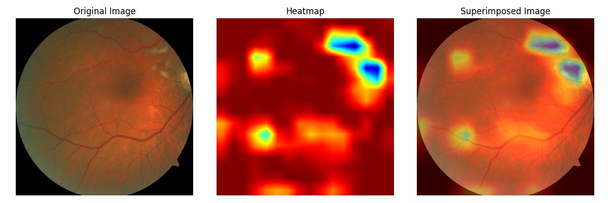

# Guided Context Gating: Learning to Leverage Salient Lesions in Retinal Fundus Images

_An attention mechanism designed to suit the identification of micro and macro lesions in retinal fundus images for accurate diabetic retinopathy classification._

This paper has been accepted at IEEE International Conference on Image Processing (ICIP), 2024.


[[IEEE Xplore]](https://ieeexplore.ieee.org/document/10647604)[[ArXiv]](https://arxiv.org/abs/2406.13126)[[Demo]](https://huggingface.co/spaces/tejacherukuri/retinal-lesion-detector)[[Dataset]](https://zenodo.org/records/4647952)

## Table of Contents
1. [Motivation](#motivation)
2. [Architecture](#architecture)
3. [Quantitative Evaluation](#quantitative-evaluation)
4. [Qualitative Evaluation](#qualitative-evaluation)
5. [Usage](#usage)
   - [Setup](#setup)
   - [Inference on Custom Samples](#inference-on-custom-samples)
   - [Inference through Huggingface Spaces](#inference-through-huggingface-spaces)
6. [Citation](#citation)

## Motivation
Diabetic Retinopathy (DR) grading is a highly challenging task due to the complexity of lesion variability and their contribution to different severity grades. Lesions such as Microaneurysms, Exudates, Hemorrhages, and Cotton Wool Spots vary significantly in size, shape, and appearance, often misleading the classification process. **Some lesions are barely visible, while others are prominent, yet every minor lesion plays a critical role in determining the correct severity grade.** Misclassifying even a single lesion can lead to incorrect grading, as the distinction between severity grades is often subtle and highly dependent on lesion characteristics.

## Architecture
Our approach consists of three key sub-blocks:
1. **Context Formulation**: Captures the global spatial context of the image.
2. **Channel Correlation**: Identifies channel-wise relationships to enhance feature relevance.
3. **Guided Gating**: Uses the global context as a guiding signal to zero in on localized lesions.


## Quantitative Evaluation
| Class | Acc   | Prec  | Rec   | F1    | AUC    | Support |
|-------|-------|-------|-------|-------|--------|-------|
| No DR | 95.65 | 91.67 | 95.65 | 93.62 | 99.43  | 23    |
| Mild NPDR | 100.0 | 100.0 | 100.0 | 100.0 | 100.0  | 01    |
| Moderate NPDR | 75.00 | 80.00 | 75.00 | 77.42 | 92.97  | 16    |
| Severe NPDR | 100.0 | 97.37 | 100.0 | 98.67 | 100    | 37    |
| Very Severe NPDR | 55.56 | 66.67 | 55.56 | 60.61 | 92.68  | 18    |
| PDR | 97.14 | 94.44 | 97.14 | 95.77 | 99.56  | 35    |
| Advanced PDR | 95.45 | 91.3  | 95.45 | 93.33 | 99.09  | 22    |
| Macro | 90.13 | 88.78 | 88.4  | 88.49 | 97.80  | 152   |
| Weighted | -   | 89.51 | 90.13 | 89.73 | 98.64  | -     |

## Qualitative Evaluation


## Usage
### Setup
1. Installing the project:
```bash
pip install git+https://github.com/TejaCherukuri/Guided-Context-Gating.git
```
2. Creating a Virtual Environment:
   - The command `python -m venv gcg_venv` works the same on **Windows**, **macOS**, and **Linux**.

3. Activating the Virtual Environment:
   - On **macOS/Linux**, use `source gcg_venv/bin/activate`.
   - On **Windows**, use `gcg_venv\Scripts\activate`.

4. Install all the necessary dependencies:
```bash
pip install -r requirements.txt
```
### Inference on Custom Samples

1. Prepare a list of test image paths (relative to your working directory).
2. Pass the list of paths to the `predict()` method from the inference pipeline.
3. The method will return predictions and generate visual outputs.

```python
from gcg.pipelines import predict

# Example test image paths
image_paths = [
    'test_images/image_1.jpg',
    'test_images/image_2.jpg'
]

# Get predictions
predictions_list = predict(image_paths)
print(predictions_list)
```
Outputs

- **Predictions**: The predicted classes for the provided images.
- **Heatmaps and Superimposed Images**:
  - Generated for each test image.
  - Saved to the `heatmaps` directory in your working directory.
    
Example heatmap:
  


### Inference through Huggingface Spaces

For those of you who prefer user interface over code, access the link to huggingface spaces [[Demo]](https://huggingface.co/spaces/tejacherukuri/Guided-Context-Gating)


### Citation
If you find GCG useful for your research and applications, please cite using this BibTeX:
```bibtex
@article{cherukuri2024guided,
  title={Guided Context Gating: Learning to leverage salient lesions in retinal fundus images},
  author={Cherukuri, Teja Krishna and Shaik, Nagur Shareef and Ye, Dong Hye},
  journal={arXiv preprint arXiv:2406.13126},
  year={2024}
}
```
